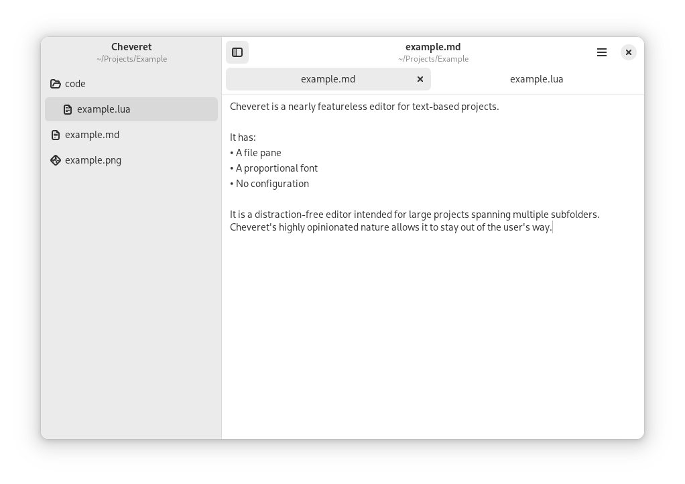
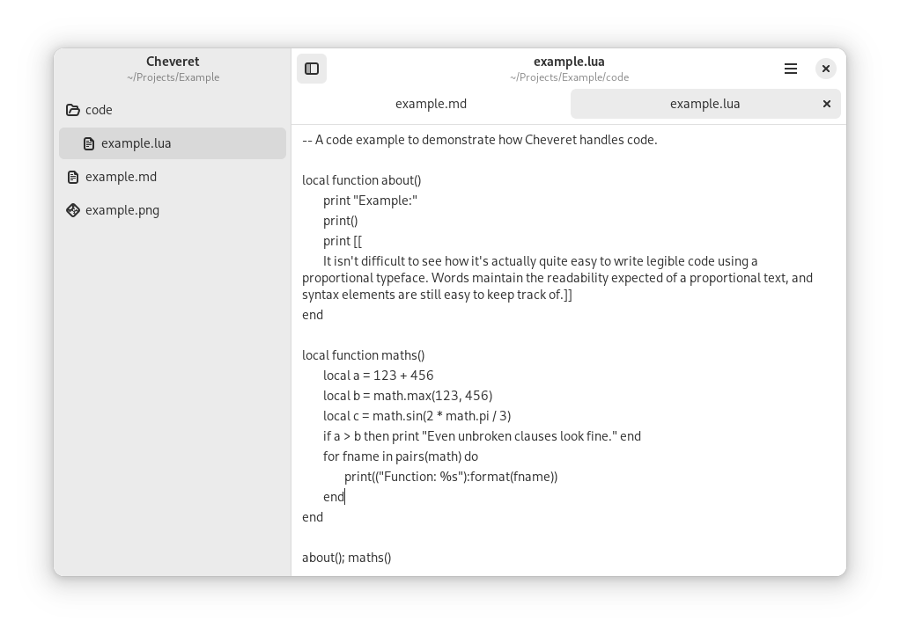

# Cheveret

A minimal, featureless text editor with a file tree for GNOME on Linux.

This is **alpha** software. There are known defects, and through its continued development any feature could change with no notice.

## Features

- Zero configuration
- File pane showing a tree for project files and subfolders
- Automatically strip trailing blanks and extraneous trailing newlines

## Known Defects

- It is possible to transfer tabs between workspace windows. This is not an intended feature and is expected to be removed in a future patch.

## Building

Cheveret compiles with [Flatpak Builder](https://docs.flatpak.org/en/latest/flatpak-builder.html).

```sh
flatpak-builder .build ca.vlacroix.Cheveret.yml --user --install --force-clean
flatpak run ca.vlacroix.Cheveret
```

To build and run the development version, add `.Devel` after the application's name.

```sh
flatpak-builder .build ca.vlacroix.Cheveret.Devel.yml --user --install --force-clean
flatpak run ca.vlacroix.Cheveret.Devel
```
