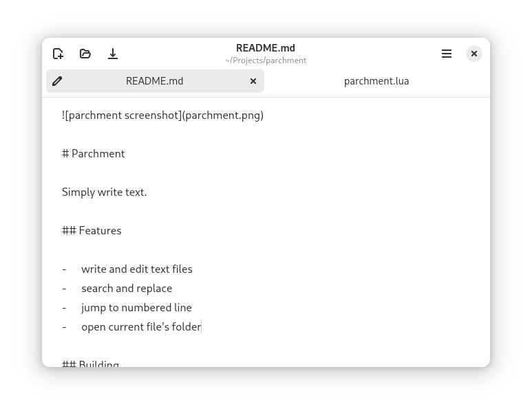

#	Parchment

Simply write text.

##	Features

-	write and edit text files
-	search and replace
-	jump to numbered line
-	open current file's folder

###	Under the Hood

Parchment automatically performs a few technical things in order to provide a pleasant text editing experience.

####	Trailing Whitespace Removal

Parchment automatically removes trailing whitespace on every line.

####	End-of-File Newline Correction

Parchment automatically ensures that all saved files end in exactly one newline character. Files saved by Parchment will work as expected in command-line applications.

####	Text Files Only

Parchment refuses to open non-textual files; Any file containing a NUL character (byte of value 0x00) will be rejected.

####	UTF-8 Validation

Parchment refuses to open files which aren't valid UTF-8.

##	Building

Parchment compiles with [Flatpak Builder](https://docs.flatpak.org/en/latest/flatpak-builder.html).

```sh
flatpak-builder .build ca.vtrlx.Parchment.json --user --install --force-clean
flatpak run ca.vtrlx.Parchment
```

To build and run the development version, add `.Devel` after the application's name.

```sh
flatpak-builder .build ca.vtrlx.Parchment.Devel.json --user --install --force-clean
flatpak run ca.vtrlx.Parchment.Devel
```
